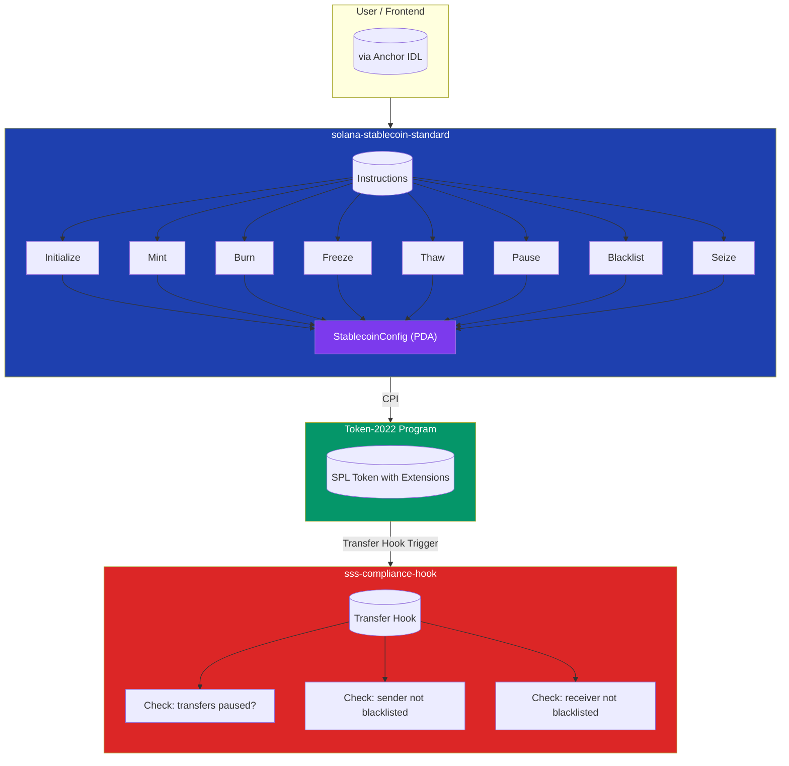

# Solana Stablecoin Standard - Technical Documentation

This document explains the key systems and design decisions in the Solana Stablecoin Standard (SSS) implementation, covering why each system is used and its benefits over alternative approaches.

---

## Table of Contents

1. [Anchor Framework](#1-anchor-framework)
2. [Token-2022 with Interface Accounts](#2-token-2022-with-interface-accounts)
3. [Transfer Hooks for Compliance](#3-transfer-hooks-for-compliance)
4. [PDA-Based Account Derivation](#4-pda-based-account-derivation)
5. [Preset System (Compliant vs Non-Compliant)](#5-preset-system-compliant-vs-non-compliant)
6. [Blacklist System](#6-blacklist-system)
7. [Built-in Transfer with Compliance Checks](#7-built-in-transfer-with-compliance-checks)
8. [CPI for Token Operations](#8-cpi-for-token-operations)
9. [Event Emission](#9-event-emission)
10. [Master Authority Pattern](#10-master-authority-pattern)

---

## 1. Anchor Framework

**What it is:** Anchor is a framework for building Solana programs that provides:

- IDL (Interface Definition Language) for cross-language compatibility
- Account validation via `#[derive(Accounts)]` macros
- CPI helpers for cross-program calls
- Error handling via `#[error_code]` macros

**Why it's used:**

- **Security:** Anchor's account validation macros ensure accounts are validated at the beginning of each instruction, preventing common exploits like account confusion attacks
- **Developer Experience:** The macro-based approach reduces boilerplate code significantly compared to raw Solana SDK
- **IDL Generation:** Auto-generates IDL for frontend integration, enabling TypeScript clients with full type safety
- **CPI Abstractions:** Simplifies cross-program calls with `CpiContext` builders

**Benefits over alternatives:**

- vs raw Solana SDK: 60-70% less boilerplate code
- vs Seabed/Sealevel: More mature ecosystem, better tooling
- vs Glass: Better understood, larger community

---

## 2. Token-2022 with Interface Accounts

**What it is:**

- SPL Token-2022 is the latest version of Solana's token standard with extension support
- `InterfaceAccount<'info, TokenAccount>` and `Interface<'info, TokenInterface>` provide abstract references that work with any token program implementing the interface

**Why it's used:**

- **Extension Support:** Token-2022 supports extensions like transfer hooks, confidential transfers, memo, etc.
- **Future-Proofing:** Interface accounts allow the program to work with any token program that implements the TokenInterface (Token-2022, Token legacy, or future versions)
- **Flexibility:** Users can choose different token programs while keeping the stablecoin logic the same

**Benefits over alternatives:**

- vs SPL Token (legacy): Supports modern extensions (transfer hooks, metadata, etc.)
- vs Custom Token Logic: Interface accounts mean the program doesn't need to implement its own token logic - delegates to the token program
- vs Mint-Only: Using full TokenAccount allows freeze/thaw/seize operations that require token account access

---

## 3. Transfer Hooks for Compliance

**What it is:** Transfer hooks are a Token-2022 extension that allows a custom program to execute logic before and/or after token transfers. The main program sets a `transfer_hook_program` in the mint config, and that program gets called automatically on every transfer.

**Why it's used:**

- **Modular Compliance:** Compliance logic is separated into its own program (sss-compliance-hook), allowing different compliance rules per use case
- **Atomic Enforcement:** Hooks run atomically with transfers - if the hook fails, the transfer fails
- **No Double-Spending:** Unlike off-chain compliance, the hook runs in the same transaction as the transfer, preventing race conditions
- **Upgradeable:** The hook program can be updated without changing the main stablecoin program

**Benefits over alternatives:**

- vs Centralized Oracle: Runs on-chain in the same transaction, no oracle dependency
- vs Off-Chain Compliance: Atomic - cannot have compliant transfers that later get reversed
- vs Direct Program Logic: Separating concerns - main program handles core logic, hook handles compliance
- vs Multiple Signers: Transfers require single signature, hook adds compliance automatically

---

## 4. PDA-Based Account Derivation

**What it is:** Program Derived Addresses (PDAs) are deterministic addresses derived from a program ID and seed bytes. They allow programs to control accounts without needing private keys.

**Implementation in SSS:**

- Config account: `seeds = [b"stablecoin", mint.key().as_ref()]`
- Blacklist entries: `seeds = [b"blacklist", config.key().as_ref(), target.key().as_ref()]`

**Why it's used:**

- **Deterministic Address Calculation:** Anyone can derive the config address from the mint address - no need to store or look up addresses
- **Program Control:** PDA accounts can only be modified by the program that owns them, providing security
- **Atomic Initialization:** Seeds ensure the config can only be created once per mint
- **Auditability:** The derivation seeds are public and verifiable on-chain

**Benefits over alternatives:**

- vs Random Addresses: Deterministic - no need to store/lookup addresses in a registry
- vs Registry: Self-contained - no external dependency for address lookups
- vs Mint as Config: Allows multiple stablecoins with different configs from the same mint extension setup

---

## 5. Preset System ( Compliant vs Non-Compliant)

**What it is:** A `preset` field in the config that determines which features are available:

- `preset = 0`: Non-compliant mode - basic stablecoin operations only
- `preset = 1`: Compliant mode - enables blacklist, freeze, transfer hook, and extra account meta list

**Why it's used:**

- **Regulatory Flexibility:** Different jurisdictions have different requirements. Non-compliant mode works for unrestricted tokens, compliant mode enables KYC/AML features
- **Feature Gating:** Advanced features like blacklist and freeze are only available in compliant mode
- **User Choice:** Deployers choose the preset that fits their use case
- **Minimal Footprint:** Non-compliant mode is simpler and cheaper to operate

**Benefits over alternatives:**

- vs Single Mode: Flexibility to support both unrestricted and regulated stablecoins
- vs Separate Programs: Single program reduces deployment complexity and attack surface
- vs Config Flags: Preset is simpler - either you have all compliance features or none

---

## 6. Blacklist System

**What it is:** A system that allows the master authority to prevent specific addresses from sending or receiving tokens. Implemented via PDA accounts storing:

- The blacklister's address
- Reason for blacklisting (up to 200 characters)
- Unix timestamp of blacklisting

**Implementation Details:**

The blacklist check in the transfer instruction uses `UncheckedAccount` for blacklist entries. This is necessary because Anchor doesn't support optional accounts with seed constraints. The validation logic:

1. Computes expected blacklist PDA: `seeds = [b"blacklist", config.key(), target.key()]`
2. Checks if provided account matches expected PDA and is owned by the program (account exists)

```rust
let (expected_sender_blacklist, _) = Pubkey::find_program_address(
    &[b"blacklist", config.key().as_ref(), sender_key.as_ref()],
    &ID,
);
let sender_blacklist_key = ctx.accounts.sender_blacklist.key();
if sender_blacklist_key == expected_sender_blacklist 
    && *ctx.accounts.sender_blacklist.owner == ID {
    return Err(StablecoinError::SenderBlacklisted.into());
}
```

**Why it's used:**

- **Regulatory Compliance:** Many jurisdictions require the ability to block sanctioned/fraudulent accounts
- **Fraud Prevention:** Can freeze funds of compromised accounts
- **Audit Trail:** Stores who blacklisted, when, and why - important for compliance
- **PDAs for Security:** Blacklist entries are PDAs controlled by the program, not user-controlled
- **Dual Protection:** Built-in transfer instruction + transfer hook provides defense in depth

**Benefits over alternatives:**

- vs Transfer Hook Only: Provides on-chain record of blacklisting with reason/timestamp
- vs Freeze Account: Blacklisting is more explicit and trackable
- vs Data Length Check: Uses account existence (owner check) as the blacklist check - cheap and reliable
- vs Separate Blacklist Program: Integrated into main program for atomic operations

---

## 7. Built-in Transfer with Compliance Checks

**What it is:** The stablecoin program includes a native `transfer` instruction that performs compliance checks (pause + blacklist) before executing the transfer via CPI to Token-2022.

**Compliance Mode Requirements:**

- **SSS-1 (preset=0):** Transfer works without a transfer hook - simpler mode for unrestricted tokens
- **SSS-2 (preset=1):** Transfer requires `transfer_hook_program` to be set - ensures full compliance protection

**Why it's used:**

- **Defense in Depth:** Even if users call Token-2022's native transfer directly, when the transfer hook is set, Token-2022 automatically calls the hook which enforces compliance
- **Pause Functionality:** Transfers can be paused globally via the `paused` flag in config
- **Blacklist Enforcement:** Both sender and receiver are checked against the blacklist before transfer
- **Atomic Operation:** All compliance checks happen in the same transaction as the transfer

**Important:** For full protection in compliant mode, you MUST call `update_transfer_hook` after initialization to set the compliance hook program. Without this, users can bypass compliance by calling Token-2022's native transfer directly.

**Implementation:**

The transfer instruction accepts two optional blacklist accounts (sender and receiver). Since Anchor doesn't support optional accounts with seed constraints, it uses `UncheckedAccount` and validates manually:

1. In compliant mode, verifies `transfer_hook_program` is set
2. Computes expected blacklist PDA from sender/receiver owner
3. Verifies provided account matches expected PDA
4. Checks account is owned by the stablecoin program (exists)
5. If all checks pass, performs CPI to Token-2022

**Benefits over alternatives:**

- vs Transfer Hook Only: Works with or without hook - provides flexibility
- vs Custom Transfer Logic: Uses standard Token-2022 CPI for security
- vs Multiple Transactions: Single transaction for compliance + transfer

---

## 8. CPI for Token Operations

**What it is:** Cross-Program Invocation (CPI) is how the stablecoin program calls the token program to perform mint, burn, freeze, thaw, and transfer operations.

**Implementation:**

```rust
anchor_spl::token_interface::mint_to(
    CpiContext::new(
        ctx.accounts.token_program.to_account_info(),
        MintTo { ... },
    ),
    amount,
)?;
```

**Why it's used:**

- **Delegation:** The stablecoin program doesn't implement token logic - it delegates to the token program
- **Standardization:** Uses standard token operations instead of custom logic
- **Security:** Token program has been audited - no need to reimplement
- **Extension Compatibility:** CPI works with Token-2022 extensions automatically

**Benefits over alternatives:**

- vs Custom Token Logic: Less code to audit, battle-tested token program
- vs Proxy Program: Direct CPI is more efficient than proxy patterns
- vs Multiple CPIs: Bundles token operations in single transaction

---

## 9. Event Emission

**What it is:** Anchor's `emit!` macro logs events that are indexed and queryable via Solana's RPC.

**Why it's used:**

- **Indexing:** Frontends/wallets can listen for events without polling
- **Auditability:** All significant actions (mint, burn, pause, blacklist) emit events
- **Debugging:** Events provide transaction trace for debugging
- **Transparency:** External systems can track on-chain activity

**Benefits over alternatives:**

- vs Return Values: Events are indexed and searchable, return values are not
- vs Logs Only: Anchor events are typed and structured
- vs Account Reads: Events push data instead of requiring pulls

---

## 10. Master Authority Pattern

**What it is:** A single `master_authority` key in the config that has control over the stablecoin, with separate role accounts for:

- **Minter:** Can mint new tokens
- **Freezer:** Can freeze/unfreeze accounts
- **Pauser:** Can pause/unpause transfers
- **Blacklister:** Can add/remove from blacklist

**Why it's used:**

- **Simplicity:** Single authority key simplifies permission management
- **Security Model:** Clear line of authority - whoever controls master_authority controls the stablecoin
- **Role Separation:** Different roles can be assigned to different keys for security (e.g., different keys for minting vs blacklisting)
- **Multi-Sig Ready:** Any role can be a multi-sig or another program (like a governance module)
- **Pending Authority:** Supports authority transfer via `pending_master_authority` field

**Benefits over alternatives:**

- vs Single Role: Role separation provides better security -Compromise of one role doesn't compromise all
- vs DAO-First: Can evolve from single authority to DAO later
- vs Separate Admin Program: Single program reduces complexity

---

## Architecture Diagram



### Account Derivation

| Account         | PDA Seeds                       |
| --------------- | ------------------------------- |
| Config          | `["stablecoin", mint]`          |
| Blacklist Entry | `["blacklist", config, target]` |

---

## Key Design Principles

1. **Separation of Concerns:** Core token logic in main program, compliance in separate hook
2. **Minimal Trust:** Programmatic controls reduce need for trusted intermediaries
3. **Regulatory Readiness:** Built-in features for compliant stablecoins
4. **Extensibility:** Transfer hooks allow custom compliance without code changes
5. **Simplicity:** Single authority model, preset-based feature gating
