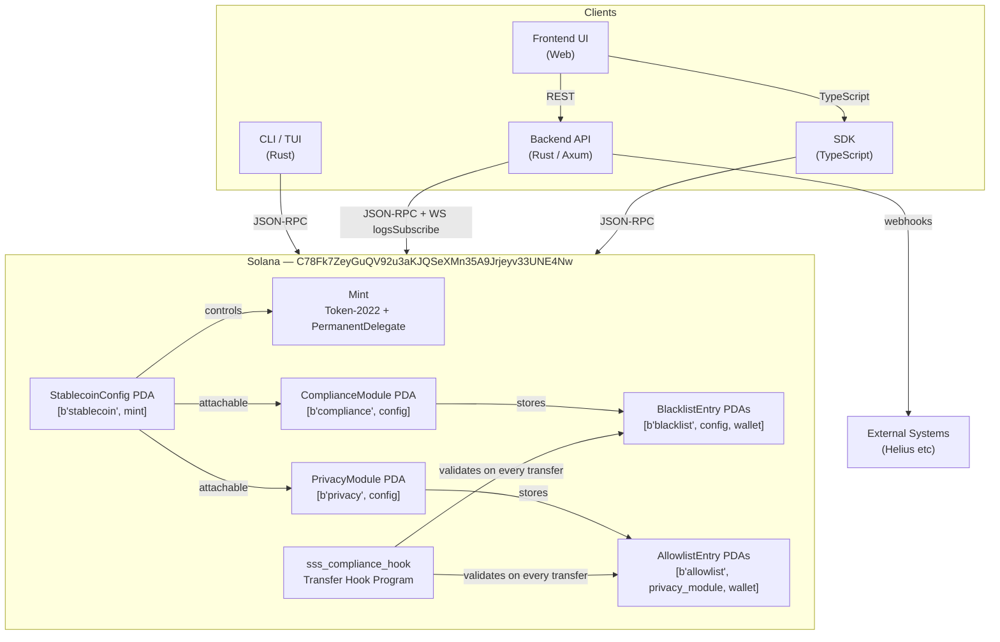
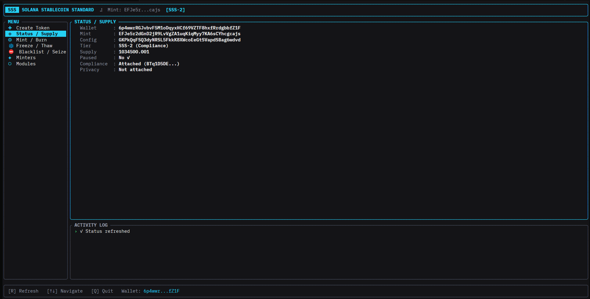
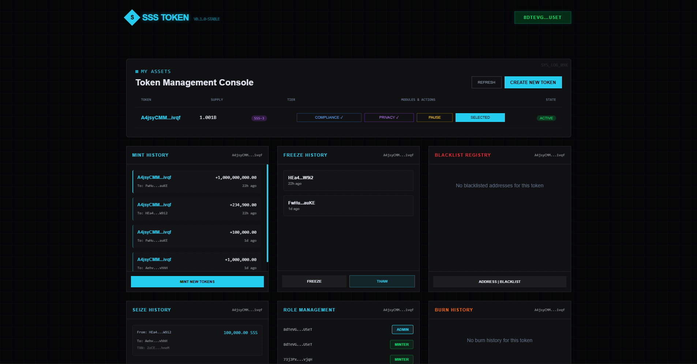

# Solana Stablecoin Standard (SSS)
[](https://opensource.org/licenses/MIT)
[](https://solana.com)
[](https://www.anchor-lang.com/)  

A production-grade, modular stablecoin system built on Solana using Anchor and Token-2022. Supports three compliance tiers with an on-chain program, a CLI/TUI tool, and a Rust backend API.

---

## Table of Contents

- [Overview](#overview)
- [Architecture Overview](#architecture-overview)
- [Tiers](#tiers)
- [On-Chain Program](#on-chain-program)
- [CLI & TUI](#cli--tui)
- [Backend API](#backend-api)
- [Getting Started](#getting-started)
- [Environment Variables](#environment-variables)
- [Instruction Reference](#instruction-reference)
- [PDA Reference](#pda-reference)
- [Discriminator Reference](#discriminator-reference)
- [Security Audit Findings](#security-audit-findings)

---

## Overview

The Solana Stablecoin Standard (SSS) provides a modular framework for creating and managing stablecoins on Solana. Unlike traditional approaches that use presets, SSS uses an additive module system:

- **SSS-1 (Base)**: Core stablecoin operations - mint, burn, freeze/thaw, pause
- **SSS-2 (+Compliance)**: Adds blacklist, seizure, transfer hook for regulatory compliance
- **SSS-3 (+Privacy)**: Adds allowlist gating for privacy-focused transfers

Tiers are **additive**. A stablecoin starts as SSS-1 and upgrades by attaching modules on-chain. Modules can be detached to downgrade back to SSS-1.

## Architecture Overview



The program uses **Token-2022 with PermanentDelegate** — the config PDA is set as permanent delegate on every mint, enabling compliant token seizure without custody risk.

---

## Tiers

| Feature                    | SSS-1 | SSS-2 | SSS-3 |
| -------------------------- | ----- | ----- | ----- |
| **Mint/Burn**              | ✅    | ✅    | ✅    |
| **Freeze/Thaw**            | ✅    | ✅    | ✅    |
| **Pause/Unpause**          | ✅    | ✅    | ✅    |
| **Minter Management**      | ✅    | ✅    | ✅    |
| **Supply Cap**             | ✅    | ✅    | ✅    |
| **Compliance Module**      | ❌    | ✅    | ✅    |
| **Blacklist**              | ❌    | ✅    | ✅    |
| **Seize**                  | ❌    | ✅    | ✅    |
| **Transfer Hook**          | ❌    | ✅    | ✅    |
| **Privacy Module**         | ❌    | ❌    | ✅    |
| **Allowlist**              | ❌    | ❌    | ✅    |
| **Confidential Transfers** | ❌    | ❌    | ✅    |

Tiers are additive. A stablecoin starts as SSS-1 and upgrades by attaching modules on-chain.

---

## On-Chain Program

**Program ID:** `C78Fk7ZeyGuQV92u3aKJQSeXMn35A9Jrjeyv33UNE4Nw`

### Account Layout

#### StablecoinConfig
Holds the mint authority, role assignments, supply cap, pause state, and pointers to optional modules.

#### ComplianceModule *(SSS-2)*
Stores blacklister authority and a reference count of active blacklist entries. Seeded: `[b"compliance", config]`.

#### PrivacyModule *(SSS-3)*
Stores allowlist authority and confidential-transfer flag. Seeded: `[b"privacy", config]`.

#### BlacklistEntry *(SSS-2)*
Per-address PDA with reason string. Seeded: `[b"blacklist", config, target_wallet]`.

#### AllowlistEntry *(SSS-3)*
Per-address PDA gating transfers. Seeded: `[b"allowlist", privacy_module, wallet]`.

### Transfer Hook

A separate `sss_compliance_hook` program validates blacklist and allowlist status on every transfer via the Token-2022 transfer hook extension. The hook receives the same accounts as the transfer instruction and reverts if either party fails compliance.

---

## CLI & TUI

### Installation

```bash
cd cli
cargo build --release
# Binary: ./target/release/sss-cli
```

### Configuration

Create `cli/config.toml`:
```toml
rpc_url = "https://api.devnet.solana.com"
keypair_path = "~/.config/solana/id.json"
mint = "<your_mint_pubkey>"        # set after first init
program_id = "C78Fk7ZeyGuQV92u3aKJQSeXMn35A9Jrjeyv33UNE4Nw"
```

### CLI Commands

```bash
# Initialize a new stablecoin mint
sss-cli init --supply-cap 1000000000000 --decimals 6

# Mint tokens
sss-cli mint --to <wallet> --amount <amount>

# Burn tokens
sss-cli burn --from <token_account> --amount <amount>

# Freeze / thaw a token account
sss-cli freeze --account <token_account>
sss-cli thaw  --account <token_account>

# Pause / unpause all transfers
sss-cli pause
sss-cli unpause

# --- SSS-2: Compliance ---
sss-cli attach-compliance --blacklister <pubkey>
sss-cli detach-compliance

sss-cli blacklist add  <wallet> --reason "Sanctions"
sss-cli blacklist remove <wallet>

sss-cli seize --from <wallet> --to <destination>

# --- SSS-3: Privacy ---
sss-cli attach-privacy --allowlist-authority <pubkey>
sss-cli detach-privacy

sss-cli allowlist add    <wallet>
sss-cli allowlist remove <wallet>
```

### Justfile Shortcuts

```bash
just cli-init
just cli-mint <recipient> <amount>
just cli-burn <token_account> <amount>
just cli-freeze <account>
just cli-thaw <account>
just cli-pause
just cli-unpause
just cli-attach-compliance <blacklister>
just cli-detach-compliance
just cli-blacklist-add <address>
just cli-blacklist-remove <address>
just cli-attach-privacy <allowlist_authority>
just cli-detach-privacy
just cli-allowlist-add <address>
just cli-allowlist-remove <address>
```

### TUI

Launch the interactive terminal dashboard:
```bash
sss-cli tui
# or
just tui
```

The TUI provides real-time status, mint/burn history, blacklist management, and section-based navigation. On first launch with no mint configured it opens the **Init** section automatically.

<!-- TUI SCREENSHOT — replace with actual image -->
> 📸 **TUI Screenshot**
> 

---

## Backend API

### Stack

- **Runtime:** Tokio async Rust
- **HTTP:** Axum
- **Solana:** Custom `RpcClient` (JSON-RPC over HTTP, no `solana-client` dep in backend)
- **Events:** WebSocket `logsSubscribe` listener with auto-reconnect
- **Webhooks:** Configurable delivery with exponential backoff retry

### Running

```bash
cd backend
cp .env.example .env   # fill in MINT_ADDRESS at minimum
cargo run --release
```

Or with Docker:
```bash
docker build -t sss-backend .
docker run --env-file .env -p 3000:3000 sss-backend
```

### API Routes

All routes return `{ success: bool, data?: T, error?: string }`.

<!-- FRONTEND UI SCREENSHOT — replace with actual image -->
> 📸 **Frontend Dashboard**
> 
> *Replace `docs/images/ui-dashboard.png` with your screenshot. Recommended size: 1400×900px.*

<!-- FRONTEND COMPLIANCE VIEW SCREENSHOT — replace with actual image -->
> 📸 **Compliance Management View** *(SSS-2 / SSS-3)*
> 
> *Replace `docs/images/ui-compliance.png` with your screenshot.*

#### Core (all tiers)

| Method | Path | Description |
|--------|------|-------------|
| `GET` | `/health` | Health check with tier, program, mint |
| `GET` | `/api/info` | Program ID, mint, tier |
| `POST` | `/api/mint` | Create mint request (fiat → token lifecycle) |
| `GET` | `/api/mint/:id` | Get mint request by ID |
| `GET` | `/api/mint/wallet/:wallet` | All mint requests for a wallet |
| `POST` | `/api/burn` | Create burn request (token → fiat lifecycle) |
| `GET` | `/api/burn/:id` | Get burn request by ID |
| `GET` | `/api/burn/wallet/:wallet` | All burn requests for a wallet |
| `GET` | `/api/events` | Indexed on-chain events (filterable) |
| `GET` | `/api/events/:signature` | Events by transaction signature |
| `POST` | `/webhook` | Helius/generic webhook receiver |

#### Compliance (SSS-2 and SSS-3 only)

| Method | Path | Description |
|--------|------|-------------|
| `GET` | `/api/compliance/check/:address` | Sanctions + blacklist check |
| `POST` | `/api/compliance/check-tx` | Check a `{ from, to, amount }` transaction |
| `GET` | `/api/compliance/blacklist` | All active blacklist entries |
| `POST` | `/api/compliance/blacklist` | Add address to blacklist |
| `DELETE` | `/api/compliance/blacklist/:address` | Remove address from blacklist |
| `GET` | `/api/compliance/rules` | Active compliance rules |
| `GET` | `/api/compliance/audit` | Audit trail export (filterable by ISO date range) |
| `GET` | `/api/compliance/stats` | Event and blacklist counts |

### Webhook Integration

The `/webhook` endpoint correlates incoming Helius events with pending off-chain requests:

- **MINT events** — matched by `fiatTxId` field, confirms the corresponding `MintRequest`
- **BURN events** — matched by `tokenAccount` field, confirms the corresponding `BurnRequest`
- **TRANSFER events** — at SSS-2/3, both `source` and `destination` are screened against the blacklist in real-time

Embed `fiatTxId` as a memo instruction in your on-chain mint transaction to enable automatic correlation.

### Event Indexer

The WebSocket listener subscribes to `logsSubscribe` for the program and parses log messages into typed `OnChainEvent` objects:

```
ConfigInitialized | TokensMinted | TokensBurned | AccountFrozen |
AccountThawed | AddedToBlacklist | RemovedFromBlacklist | TokensSeized | PausedChanged
```

Events are held in-memory and available via `/api/events`. Wire `EventIndexer` to a database for persistence.

### Compliance Audit Trail

All mint, burn, blacklist, and on-chain events are recorded to `ComplianceService`'s internal audit log. Export via `GET /api/compliance/audit?from=<ISO>&to=<ISO>`. The in-memory log caps at 10,000 entries — swap to a database in production.

---

## Getting Started

### Prerequisites

- Rust 1.75+
- Solana CLI 1.18+
- Anchor CLI 0.30+
- `just` (optional, for Justfile shortcuts)

### Devnet Quickstart

```bash
# 1. Build the program
anchor build

# 2. Deploy to devnet
anchor deploy --provider.cluster devnet

# 3. Initialize a mint
just cli-init

# 4. Copy the printed mint address into cli/config.toml

# 5. Mint some tokens
just cli-mint <your-wallet> 1000000

# 6. Start the backend
cd backend && cargo run --release

# 7. Verify
curl http://localhost:3000/health
```

### Upgrade to SSS-2

```bash
just cli-attach-compliance <blacklister-pubkey>
# Set SSS_TIER=SSS-2 in backend .env and restart
```

### Upgrade to SSS-3

```bash
just cli-attach-privacy <allowlist-authority-pubkey>
# Set SSS_TIER=SSS-3 in backend .env and restart
```

---

## Environment Variables

```bash
# ── Required ─────────────────────────────────────────
MINT_ADDRESS=<your_mint_pubkey>

# ── Program ──────────────────────────────────────────
PROGRAM_ID=C78Fk7ZeyGuQV92u3aKJQSeXMn35A9Jrjeyv33UNE4Nw
MINTER_ADDRESS=          # defaults to MINT_ADDRESS
DECIMALS=6
MAX_SUPPLY=1000000000000000

# ── Network ───────────────────────────────────────────
RPC_URL=https://api.devnet.solana.com
WS_URL=wss://api.devnet.solana.com

# ── Tier ─────────────────────────────────────────────
SSS_TIER=SSS-1           # SSS-1 | SSS-2 | SSS-3

# ── Server ───────────────────────────────────────────
PORT=3000

# ── Webhooks ──────────────────────────────────────────
WEBHOOK_ENABLED=false
WEBHOOK_URL=https://your-endpoint.com/hook
WEBHOOK_SECRET=your_hmac_secret

# ── Compliance (SSS-2/3) ──────────────────────────────
SANCTIONS_API_URL=       # Chainalysis / Elliptic endpoint (optional)

# ── Logging ───────────────────────────────────────────
RUST_LOG=info

# ── CLI / Tests ───────────────────────────────────────
PRIVATE_KEY_BASE58=<base58_encoded_keypair>
```

---

## Instruction Reference

### initialize
```
Args:    supply_cap: Option<u64>, decimals: u8
Accounts: config(w,init), mint(w,signer), master_authority(w,signer),
          token_program, system_program
```

### mint_tokens
```
Args:    amount: u64
Accounts: config(r), mint(w), destination(w), minter(signer), token_program
```

### burn_tokens
```
Args:    amount: u64
Accounts: config(r), mint(w), from(w), burner(signer), token_program
```

### freeze_account / thaw_account
```
Args:    none
Accounts: config(r), mint(r), account(w), freezer(signer), token_program
```

### seize *(SSS-2)*
```
Args:    none
Accounts: config(r), compliance_module(r), mint(r), source_blacklist(r),
          source(w), destination(w), seizer(signer), token_program
```

### blacklist_add / blacklist_remove *(SSS-2)*
```
blacklist_add args:    reason: String
blacklist_add accounts: blacklist_entry(w,init), compliance_module(r),
                        config(r), blacklister(w,signer), target(r), system_program

blacklist_remove accounts: blacklist_entry(w,close), compliance_module(r),
                           config(r), master_authority(signer), target(r), authority(w,signer)
```

### attach_compliance_module / detach_compliance_module *(SSS-2)*
```
attach args:    blacklister: Pubkey, transfer_hook_program: Option<Pubkey>,
                permanent_delegate: Option<Pubkey>
attach accounts: compliance_module(w,init), config(r), master_authority(signer),
                 authority(w,signer), system_program

detach accounts: compliance_module(w,close), config(r), master_authority(signer),
                 authority(w,signer)
```

### attach_privacy_module / detach_privacy_module *(SSS-3)*
```
attach args:    allowlist_authority: Pubkey, confidential: bool
attach accounts: privacy_module(w,init), config(r), master_authority(signer),
                 authority(w,signer), system_program
```

### update_paused
```
Args:    paused: bool
Data:    discriminator(8) + paused as u8
```

### allowlist_add / allowlist_remove *(SSS-3)*
```
allowlist_add accounts:    allowlist_entry(w,init), privacy_module(r), config(r),
                           allowlist_authority(w,signer), wallet(r), system_program

allowlist_remove accounts: allowlist_entry(w,close), privacy_module(r), config(r),
                           allowlist_authority(signer), wallet(r), authority(w,signer)
```

---

## PDA Reference

| Account | Seeds |
|---------|-------|
| `StablecoinConfig` | `[b"stablecoin", mint]` |
| `ComplianceModule` | `[b"compliance", config]` |
| `PrivacyModule` | `[b"privacy", config]` |
| `BlacklistEntry` | `[b"blacklist", config, target_wallet]` |
| `AllowlistEntry` | `[b"allowlist", privacy_module, wallet]` |

---

## Discriminator Reference

All discriminators are computed as `sha256("global:<name>")[..8]`.

| Instruction | Discriminator |
|-------------|---------------|
| `initialize` | `[0xaf, 0xaf, 0x6d, 0x1f, 0x0d, 0x98, 0x9b, 0xed]` |
| `mint_tokens` | `[0x3b, 0x84, 0x18, 0xf6, 0x7a, 0x27, 0x08, 0xf3]` |
| `burn_tokens` | `[0x4c, 0x0f, 0x33, 0xfe, 0xe5, 0xd7, 0x79, 0x42]` |
| `freeze_account` | `[0xfd, 0x4b, 0x52, 0x85, 0xa7, 0xee, 0x2b, 0x82]` |
| `thaw_account` | `[0x73, 0x98, 0x4f, 0xd5, 0xd5, 0xa9, 0xb8, 0x23]` |
| `seize` | `[0x81, 0x9f, 0x8f, 0x1f, 0xa1, 0xe0, 0xf1, 0x54]` |
| `blacklist_add` | `[0xfe, 0xb8, 0x83, 0xc8, 0x91, 0x32, 0x2b, 0xf4]` |
| `blacklist_remove` | `[0x11, 0x26, 0xe2, 0x2c, 0x13, 0x8f, 0x59, 0x1b]` |
| `allowlist_add` | `[0x2a, 0x05, 0x81, 0x9f, 0x37, 0xa5, 0x67, 0xcb]` |
| `allowlist_remove` | `[0x1e, 0x14, 0x53, 0xd2, 0xbc, 0x9b, 0xd3, 0xa3]` |
| `attach_compliance_module` | `[0x48, 0x91, 0xd0, 0x36, 0x71, 0xc2, 0x8c, 0x63]` |
| `detach_compliance_module` | `[0x5f, 0x9f, 0x02, 0x8d, 0x7b, 0x5e, 0xb0, 0x1b]` |
| `attach_privacy_module` | `[0xc7, 0x13, 0xab, 0x51, 0x09, 0x3e, 0x73, 0x00]` |
| `detach_privacy_module` | `[0x95, 0x68, 0x34, 0x82, 0x47, 0xac, 0xe2, 0x3f]` |
| `update_paused` | `[0x4e, 0xec, 0x55, 0x68, 0xa9, 0xe7, 0xcd, 0x59]` |
| `add_minter` | `[0x4b, 0x56, 0xda, 0x28, 0xdb, 0x06, 0x8d, 0x1d]` |
| `remove_minter` | `[0xf1, 0x45, 0x54, 0x10, 0xa4, 0xe8, 0x83, 0x4f]` |

---

## Security Audit Findings

A full security audit was conducted using the **Frank Castle framework** prior to devnet deployment. Summary of findings:

### Critical (3) — Resolved
- **Blacklist bypass** — Transfer hook could be circumvented by passing a stale account; fixed by validating account derivation on-chain.
- **Arithmetic overflow** — Unchecked addition in supply cap check; fixed with `checked_add`.
- **Wrong role authorization** — Freeze instruction was accepting the minter role instead of freezer; fixed with correct role check.

### High
- Permanent delegate not set before mint initialization on early versions; fixed in `init.rs` — config PDA is now set as permanent delegate before `initialize_mint2`.

### Status
The program is deployed on devnet and under active development. **Not yet audited for mainnet.** A production audit is required before mainnet deployment.

---

## Project Structure

```
sss/
├── programs/
│   └── sss/               # Anchor program
│       └── src/
│           ├── lib.rs
│           ├── instructions/
│           └── state/
├── sss_compliance_hook/   # Transfer hook program
├── cli/                   # CLI + TUI (Rust)
│   └── src/
│       ├── main.rs
│       ├── commands/
│       │   ├── init.rs
│       │   ├── mint.rs
│       │   ├── burn.rs
│       │   ├── freeze.rs
│       │   ├── thaw.rs
│       │   ├── seize.rs
│       │   ├── blacklist.rs
│       │   ├── compliance.rs
│       │   ├── privacy.rs
│       │   └── allowlist.rs
│       ├── tui.rs
│       ├── rpc_client.rs
│       ├── signer.rs
│       └── utils.rs
├── backend/               # Axum REST API (Rust)
│   └── src/
│       ├── main.rs
│       ├── routes/
│       │   ├── health.rs
│       │   └── webhook.rs
│       └── services/
│           ├── rpc.rs
│           ├── solana.rs
│           ├── mint_burn.rs
│           ├── compliance.rs
│           ├── events.rs
│           └── webhook.rs
├── Justfile
├── Anchor.toml
└── README.md
```
