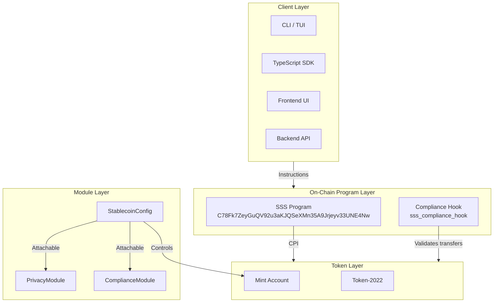
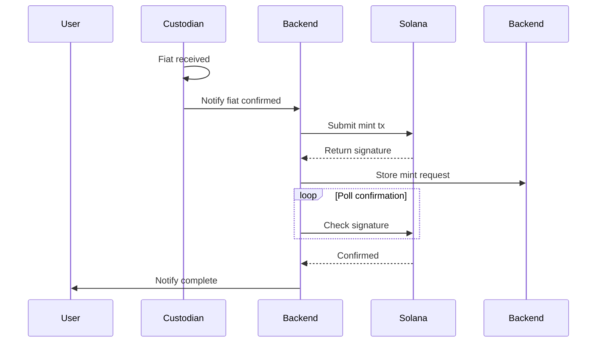
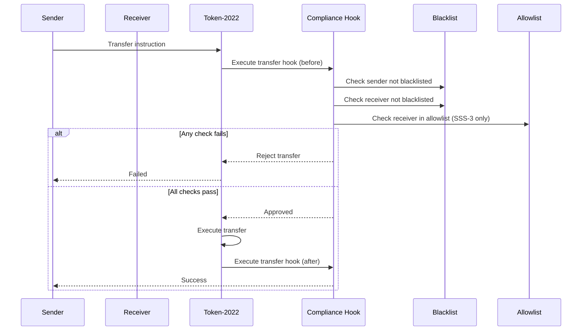
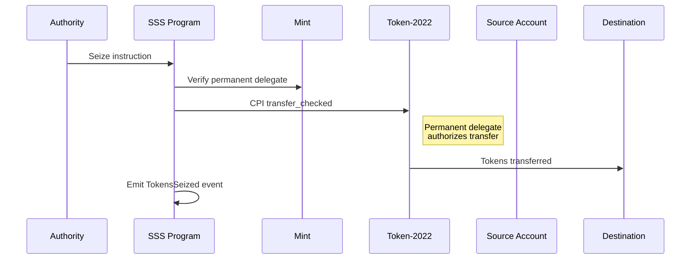
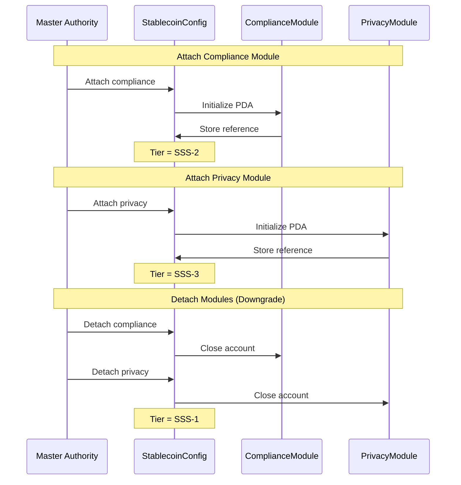

# Architecture

This document describes the Solana Stablecoin Standard (SSS) architecture, including the layer model, data flows, and security modes.

---

## Table of Contents

- [Layer Model](#layer-model)
- [Data Flows](#data-flows)
- [Security Modes](#security-modes)
- [Account Structure](#account-structure)
- [PDA Derivation](#pda-derivation)
- [Event System](#event-system)

---

## Layer Model

SSS follows a layered architecture that separates concerns and enables modular upgrades:



### Layer Responsibilities

| Layer       | Responsibility   | Components                      |
| ----------- | ---------------- | ------------------------------- |
| **Client**  | User interaction | CLI, SDK, Frontend, Backend     |
| **Program** | Business logic   | SSS Program, Compliance Hook    |
| **Token**   | Token operations | Token-2022, Mint, TokenAccounts |
| **Module**  | Feature control  | Config, Compliance, Privacy     |

---

## Data Flows

### Mint Flow (Fiat On-Ramp)



### Transfer Flow (SSS-2/SSS-3)



### Seize Flow (SSS-2 Only)



### Module Attach/Detach Flow



---

## Security Modes

### Mode 1: SSS-1 (Base)

**Characteristics:**

- No compliance module attached
- No privacy module attached
- Basic token operations only

**Security Model:**

- Single authority (master_authority)
- Role-based permissions (minter, freezer, pauser)
- Supply cap enforcement
- Pause functionality

**Threats Mitigated:**

- Unauthorized minting (minter role)
- Unauthorized freezing (freezer role)
- Supply overflow (supply cap)

### Mode 2: SSS-2 (Compliance)

**Adds:**

- ComplianceModule with blacklister role
- Transfer hook for compliance enforcement
- Permanent delegate for seizure

**Security Model:**

- All SSS-1 controls
- Blacklist enforcement on every transfer
- Seizure capability for sanctioned accounts
- Audit trail for all compliance actions

**Additional Threats Mitigated:**

- Sanctioned entity transfers
- Fraudulent account activity
- Regulatory non-compliance

### Mode 3: SSS-3 (Privacy)

**Adds:**

- PrivacyModule with allowlist authority
- Allowlist gating for transfers
- Confidential transfers support

**Security Model:**

- All SSS-2 controls
- Transfer allowlisting
- Optional confidential transfers

**Additional Threats Mitigated:**

- Unauthorized recipient transfers
- Privacy breach attempts

---

## Account Structure

### StablecoinConfig

```rust
pub struct StablecoinConfig {
    pub master_authority: Pubkey,      // 32 - full control
    pub mint: Pubkey,                  // 32 - associated mint
    pub paused: bool,                  // 1  - global pause
    pub supply_cap: Option<u64>,       // 9  - max supply
    pub decimals: u8,                  // 1  - token decimals
    pub bump: u8,                      // 1  - PDA bump
    pub pending_master_authority: Option<Pubkey>, // 33 - transfer pending
    pub minters: Vec<Pubkey>,          // 324 - authorized minters
    pub freezer: Pubkey,               // 32 - freeze authority
    pub pauser: Pubkey,                // 32 - pause authority
}
```

### ComplianceModule (SSS-2)

```rust
pub struct ComplianceModule {
    pub config: Pubkey,                 // 32 - back-ref to config
    pub authority: Pubkey,              // 32 - module authority
    pub blacklister: Pubkey,            // 32 - blacklist authority
    pub transfer_hook_program: Option<Pubkey>, // 33 - hook program
    pub permanent_delegate: Option<Pubkey>,    // 33 - seizure authority
    pub bump: u8,                       // 1
}
```

### PrivacyModule (SSS-3)

```rust
pub struct PrivacyModule {
    pub config: Pubkey,                 // 32 - back-ref to config
    pub authority: Pubkey,              // 32 - module authority
    pub allowlist_authority: Pubkey,    // 32 - allowlist authority
    pub confidential_transfers_enabled: bool, // 1
    pub bump: u8,                      // 1
}
```

### BlacklistEntry (SSS-2)

```rust
pub struct BlacklistEntry {
    pub blacklister: Pubkey,  // 32 - who added this entry
    pub reason: String,       // 128 - reason for blacklisting
    pub timestamp: i64,       // 8 - when added
    pub bump: u8,            // 1
}
```

### AllowlistEntry (SSS-3)

```rust
pub struct AllowlistEntry {
    pub wallet: Pubkey,      // 32 - whitelisted wallet
    pub approved_by: Pubkey, // 32 - who added
    pub approved_at: i64,   // 8 - when added
    pub bump: u8,           // 1
}
```

---

## PDA Derivation

| Account          | Seeds                                    | Authority |
| ---------------- | ---------------------------------------- | --------- |
| StablecoinConfig | `[b"stablecoin", mint]`                  | Program   |
| ComplianceModule | `[b"compliance", config]`                | Program   |
| PrivacyModule    | `[b"privacy", config]`                   | Program   |
| BlacklistEntry   | `[b"blacklist", config, target]`         | Program   |
| AllowlistEntry   | `[b"allowlist", privacy_module, wallet]` | Program   |

---

## Event System

All significant actions emit on-chain events:

```rust
enum Event {
    ConfigInitialized { mint: Pubkey, authority: Pubkey },
    TokensMinted { amount: u64, recipient: Pubkey },
    TokensBurned { amount: u64, account: Pubkey },
    AccountFrozen { account: Pubkey },
    AccountThawed { account: Pubkey },
    PausedChanged { paused: bool },
    AddedToBlacklist { address: Pubkey, reason: String },
    RemovedFromBlacklist { address: Pubkey },
    TokensSeized { from: Pubkey, to: Pubkey, amount: u64 },
    MinterUpdated { added: bool, minter: Pubkey },
    FreezerUpdated { freezer: Pubkey },
    PauserUpdated { pauser: Pubkey },
    BlacklisterUpdated { blacklister: Pubkey },
}
```

Events are indexed by the backend for queryable access via the API.
