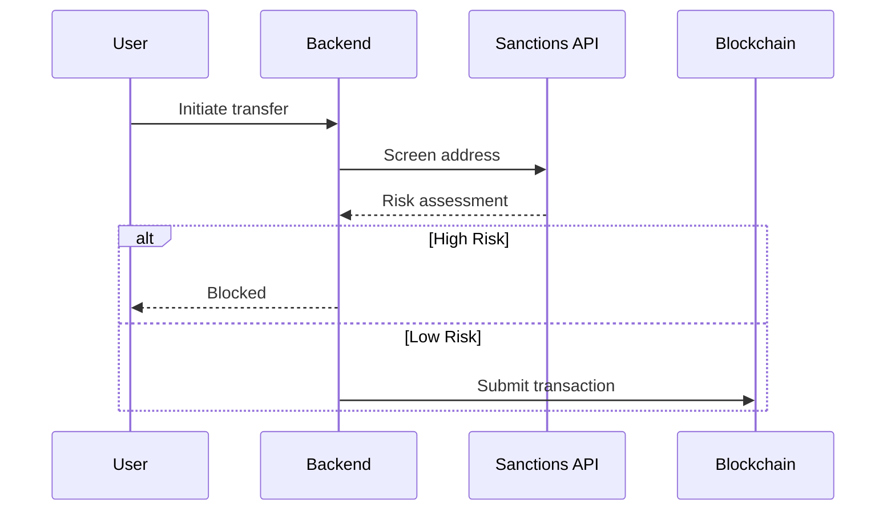

# Compliance Guide

This document covers regulatory considerations and audit trail requirements for operating an SSS stablecoin.

---

## Table of Contents

- [Regulatory Considerations](#regulatory-considerations)
- [Compliance Features](#compliance-features)
- [Audit Trail](#audit-trail)
- [Sanctions Screening](#sanctions-screening)
- [Data Retention](#data-retention)
- [Best Practices](#best-practices)

---

## Regulatory Considerations

### Jurisdiction-Specific Requirements

SSS supports multiple compliance tiers to meet different regulatory requirements:

| Requirement             | SSS-1 | SSS-2 | SSS-3 |
| ----------------------- | ----- | ----- | ----- |
| KYC/AML controls        | ❌    | ✅    | ✅    |
| Sanctions screening     | ❌    | ✅    | ✅    |
| Freeze/seize capability | ❌    | ✅    | ✅    |
| Transaction limits      | ❌    | ❌    | ❌    |
| Identity verification   | ❌    | ❌    | ❌    |

### Common Regulatory Frameworks

#### US (SEC/CFTC)

- Stablecoins may be securities or commodities
- Requires robust compliance program
- SSS-2 with full audit trail recommended

#### EU (MiCA)

- Significant implications for stablecoins
- Requires e-money license or credit institution
- SSS-2 or SSS-3 with full KYC integration

#### Singapore (PSA)

- Stablecoins regulated as digital payment tokens
- SSS-2 with MAS-compliant screening

---

## Compliance Features

### Blacklist Management

The blacklist system provides:

- **On-chain storage**: Immutable record of blacklisted addresses
- **Reason tracking**: Up to 128 characters per entry
- **Timestamp**: Unix timestamp for audit trail
- **Authority tracking**: Who added each entry

#### Blacklist Entry Schema

```json
{
  "address": "7xKXtg2CW87d97TXJSDpbD5jBkheTqA83TZRuJosgAsU",
  "reason": "OFAC sanctions",
  "blacklister": "AuthorityPubkeyHere",
  "timestamp": 1704067200,
  "status": "Active"
}
```

### Seizure Capability

Token seizure uses Token-2022's Permanent Delegate:

- **Irrevocable**: Cannot be removed once set
- **No owner consent**: Transfers without account owner signature
- **Regulatory requirement**: Required by many jurisdictions

### Transfer Hook

Automatic compliance on every transfer:

- **Atomic enforcement**: Runs in same transaction as transfer
- **No bypass**: Even direct Token-2022 transfers are checked
- **Defense in depth**: Both sender and receiver checked

---

## Audit Trail

### Event Types

All compliance-relevant actions emit on-chain events:

| Event                  | Description                |
| ---------------------- | -------------------------- |
| `ConfigInitialized`    | Mint initialized           |
| `TokensMinted`         | Tokens created             |
| `TokensBurned`         | Tokens destroyed           |
| `AccountFrozen`        | Account frozen             |
| `AccountThawed`        | Account unfrozen           |
| `PausedChanged`        | Global pause changed       |
| `AddedToBlacklist`     | Address blacklisted        |
| `RemovedFromBlacklist` | Address unblacklisted      |
| `TokensSeized`         | Tokens seized from account |
| `MinterUpdated`        | Minter role changed        |
| `FreezerUpdated`       | Freezer role changed       |
| `PauserUpdated`        | Pauser role changed        |
| `BlacklisterUpdated`   | Blacklister role changed   |

### Audit Log Format

The backend maintains an audit log with this structure:

```json
{
  "id": "evt_abc123",
  "event_type": "AddedToBlacklist",
  "signature": "5abc123...",
  "slot": 123456789,
  "timestamp": "2024-01-01T00:00:00Z",
  "data": {
    "address": "7xKXtg2...",
    "reason": "OFAC sanctions",
    "blacklister": "AuthPubkey..."
  },
  "processed": true
}
```

### Exporting Audit Trail

```bash
# Export via API
curl "http://localhost:3000/api/compliance/audit?from=2024-01-01&to=2024-12-31"
```

Response:

```json
{
  "success": true,
  "data": {
    "events": [
      {
        "event_type": "AddedToBlacklist",
        "signature": "5abc123...",
        "timestamp": "2024-01-15T10:30:00Z",
        "data": {
          "address": "7xKXtg2CW87d97TXJSDpbD5jBkheTqA83TZRuJosgAsU",
          "reason": "OFAC sanctions"
        }
      }
    ],
    "total": 1,
    "from": "2024-01-01",
    "to": "2024-12-31"
  }
}
```

---

## Sanctions Screening

### Integration Points

SSS can integrate with sanctions screening providers:

```
Backend --> Sanctions API (Chainalysis, Elliptic, etc.)
              |
              v
        Screening Result --> Allow/Block
```

### Configuration

```bash
# Environment variable for sanctions API
SANCTIONS_API_URL=https://api.chainalysis.com
SANCTIONS_API_KEY=your_api_key
```

### Screening Workflow



---

## Data Retention

### On-Chain Data

- **Permanent**: All events and state changes are immutable
- **Public**: Anyone can query via RPC
- **Indexed**: Backend indexes for fast queries

### Off-Chain Data

The backend maintains:

- **Mint requests**: Until confirmed/failed
- **Burn requests**: Until confirmed/failed
- **Audit log**: In-memory (10,000 entry cap)

**Recommendation**: For production, persist to database:

```sql
CREATE TABLE audit_log (
    id SERIAL PRIMARY KEY,
    event_type VARCHAR(50) NOT NULL,
    signature VARCHAR(100) NOT NULL,
    slot BIGINT NOT NULL,
    timestamp TIMESTAMP NOT NULL,
    data JSONB,
    created_at TIMESTAMP DEFAULT NOW()
);

CREATE INDEX idx_audit_timestamp ON audit_log(timestamp);
CREATE INDEX idx_audit_event_type ON audit_log(event_type);
```

---

## Best Practices

### Operational Security

1. **Multi-sig for critical actions**

   - Blacklist additions should require multiple approvals
   - Seizure operations should have explicit governance approval

2. **Role separation**

   - Different keys for minter vs freezer vs blacklister
   - No single key has all permissions

3. **Audit logging**
   - All compliance actions logged with full context
   - Regular audit reviews

### Technical Security

1. **Monitor for bypass attempts**

   - Watch for direct Token-2022 calls (no hook)
   - Alert on unexpected transfer patterns

2. **Keep modules attached**

   - Only detach compliance when absolutely necessary
   - Document any downgrades

3. **Regular audits**
   - Third-party security audits
   - Penetration testing

### Documentation

Maintain records of:

- All blacklist additions with reason
- All seizure transactions with approval
- All role changes
- All pause/unpause events

---

## Compliance Checklist

Before mainnet deployment:

- [ ] Legal opinion obtained
- [ ] KYC/AML program in place
- [ ] Sanctions screening integrated
- [ ] Audit trail configured
- [ ] Data retention policy defined
- [ ] Incident response plan documented
- [ ] Third-party security audit completed
- [ ] Regulatory filing submitted (if required)
