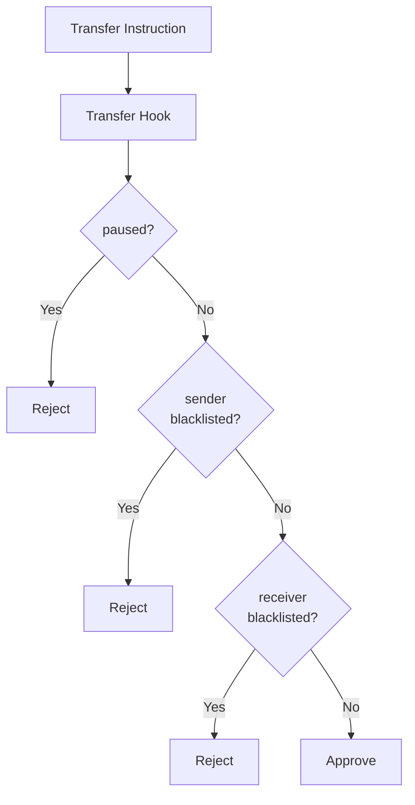

# SSS-2: Compliant Stablecoin Standard

This document defines the SSS-2 specification - the compliance tier of the Solana Stablecoin Standard. SSS-2 extends SSS-1 with compliance features including blacklist, seizure, and transfer hook enforcement.

---

## Table of Contents

- [Overview](#overview)
- [Features](#features)
- [Account Structure](#account-structure)
- [Instructions](#instructions)
- [Transfer Hook](#transfer-hook)
- [PDA Reference](#pda-reference)
- [Security Model](#security-model)
- [Downgrading to SSS-1](#downgrading-to-sss-1)
- [Upgrading to SSS-3](#upgrading-to-sss-3)

---

## Overview

SSS-2 adds regulatory compliance capabilities on top of SSS-1:

- **Blacklist**: Block specific addresses from sending/receiving
- **Seize**: Forcibly transfer tokens from blacklisted accounts
- **Transfer Hook**: Automatic compliance checks on every transfer

**Status:** Compliance module attached

---

## Features

### SSS-1 Features (Inherited)

| Feature     | Description                 |
| ----------- | --------------------------- |
| **Mint**    | Create new tokens           |
| **Burn**    | Destroy tokens              |
| **Freeze**  | Freeze a specific account   |
| **Thaw**    | Unfreeze an account         |
| **Pause**   | Stop all transfers globally |
| **Unpause** | Resume transfers            |

### SSS-2 Additional Features

| Feature           | Description                               |
| ----------------- | ----------------------------------------- |
| **Blacklist**     | Block addresses from transfers            |
| **Seize**         | Transfer tokens from blacklisted accounts |
| **Transfer Hook** | Automatic compliance on every transfer    |

---

## Account Structure

### ComplianceModule

```rust
pub struct ComplianceModule {
    pub config: Pubkey,                         // 32 - back-ref to config
    pub authority: Pubkey,                      // 32 - module authority
    pub blacklister: Pubkey,                    // 32 - blacklist authority
    pub transfer_hook_program: Option<Pubkey>,  // 33 - hook program
    pub permanent_delegate: Option<Pubkey>,     // 33 - seizure authority
    pub bump: u8,                               // 1
}
```

### BlacklistEntry

```rust
pub struct BlacklistEntry {
    pub blacklister: Pubkey,  // 32 - who added this entry
    pub reason: String,       // 128 - reason (max 128 chars)
    pub timestamp: i64,        // 8 - Unix timestamp
    pub bump: u8,             // 1
}
```

---

## Instructions

### attach_compliance_module

Attach the compliance module to enable SSS-2 features.

**Discriminator:** `4891d03671c28c63`

**Arguments:**

```rust
struct AttachComplianceArgs {
    pub blacklister: Pubkey,                         // Blacklist authority
    pub transfer_hook_program: Option<Pubkey>,      // Hook program (optional)
    pub permanent_delegate: Option<Pubkey>,         // Seizure authority (optional)
}
```

**Accounts:**
| Role | Write | Sign | Description |
|------|-------|------|-------------|
| compliance_module | ✅ | ✅ | ComplianceModule PDA (init) |
| config | | ✅ | StablecoinConfig |
| authority | | ✅ | Master authority |
| system_program | | | System program |

**Logic:**

1. Derive compliance PDA: `[b"compliance", config]`
2. Initialize ComplianceModule
3. Set transfer_hook_program if provided
4. Store reference in config

---

### detach_compliance_module

Remove the compliance module (downgrade to SSS-1).

**Discriminator:** `5f9f028d7b5eb01b`

**Accounts:**
| Role | Write | Sign | Description |
|------|-------|------|-------------|
| compliance_module | ✅ | | ComplianceModule PDA (close) |
| config | | ✅ | StablecoinConfig |
| authority | | ✅ | Master authority |

**Warning:** This closes all blacklist entries and removes compliance functionality.

---

### blacklist_add

Add an address to the blacklist.

**Discriminator:** `feb883c891322bf4`

**Arguments:**

```rust
struct BlacklistAddArgs {
    pub reason: String,  // Reason for blacklisting (max 128 chars)
}
```

**Accounts:**
| Role | Write | Sign | Description |
|------|-------|------|-------------|
| blacklist_entry | ✅ | ✅ | BlacklistEntry PDA (init) |
| compliance_module | | | ComplianceModule |
| config | | | StablecoinConfig |
| blacklister | | ✅ | Blacklister authority |
| target | | | Account to blacklist |
| system_program | | | System program |

**Logic:**

1. Derive blacklist PDA: `[b"blacklist", config, target]`
2. Store blacklister, reason, timestamp
3. Emit `AddedToBlacklist` event

---

### blacklist_remove

Remove an address from the blacklist.

**Discriminator:** `1126e22c138f591b`

**Accounts:**
| Role | Write | Sign | Description |
|------|-------|------|-------------|
| blacklist_entry | ✅ | | BlacklistEntry PDA (close) |
| compliance_module | | | ComplianceModule |
| config | | | StablecoinConfig |
| master_authority | | ✅ | Master authority |
| target | | | Account to unblacklist |
| authority | | ✅ | Authority |

---

### seize

Forcibly transfer tokens from a blacklisted account.

**Discriminator:** `819f8f1fa1e0f154`

**Accounts:**
| Role | Write | Sign | Description |
|------|-------|------|-------------|
| config | | | StablecoinConfig |
| compliance_module | | | ComplianceModule |
| mint | | | Token-2022 mint |
| source_blacklist | | | BlacklistEntry for source |
| source | ✅ | | Source token account |
| destination | ✅ | | Destination token account |
| seizer | | ✅ | Seizer authority (permanent delegate) |
| token_program | | | Token-2022 program |

**Logic:**

1. Verify compliance module attached
2. Verify source is blacklisted
3. Verify seizer is permanent delegate
4. CPI to Token-2022: `transfer_checked` with permanent delegate
5. Emit `TokensSeized` event

---

## Transfer Hook

The SSS-2 compliance module includes a transfer hook that validates every transfer.

### Hook Program

**Program ID:** `2fLexdN1nyTkWNcnagCSbVKUZ262d8WWAzeQUdjoEt88`

### Validation Logic

On every transfer, the hook checks:

1. **Global Pause**: If config.paused == true, reject transfer
2. **Sender Blacklist**: If sender is blacklisted, reject transfer
3. **Receiver Blacklist**: If receiver is blacklisted, reject transfer

### Program Flow



---

## PDA Reference

| Account          | Seeds                                        | Size       |
| ---------------- | -------------------------------------------- | ---------- |
| ComplianceModule | `[b"compliance", config.key()]`              | ~165 bytes |
| BlacklistEntry   | `[b"blacklist", config.key(), target.key()]` | ~170 bytes |

---

## Security Model

### Authority Hierarchy

```
master_authority
    ├── minter (can mint)
    ├── freezer (can freeze/thaw)
    ├── pauser (can pause/unpause)
    └── blacklister (can blacklist/seize)
```

### Permanent Delegate

The compliance module uses Token-2022's Permanent Delegate extension:

- Cannot be removed once set
- Authorizes seizure without account owner consent
- Required by many regulatory frameworks

### Threat Mitigation

| Threat                      | Mitigation                      |
| --------------------------- | ------------------------------- |
| Sanctioned entity transfers | Blacklist + Transfer Hook       |
| Fraudulent accounts         | Seizure capability              |
| Regulatory non-compliance   | Audit trail                     |
| Hook bypass                 | Transfer hook required in SSS-2 |

---

## Downgrading to SSS-1

To remove compliance features (downgrade to SSS-1):

```bash
sss-cli detach-compliance
```

**Warning:** This action:

- Closes the ComplianceModule account
- Removes all blacklist entries
- Disables transfer hook enforcement
- Cannot be undone (entries are lost)

---

## Upgrading to SSS-3

To add privacy features, attach the privacy module:

```bash
sss-cli attach-privacy --allowlist-authority <pubkey>
```

This creates a PrivacyModule PDA and enables:

- Allowlist gating for transfers
- Optional confidential transfers

See [Architecture](./ARCHITECTURE.md) for details.
