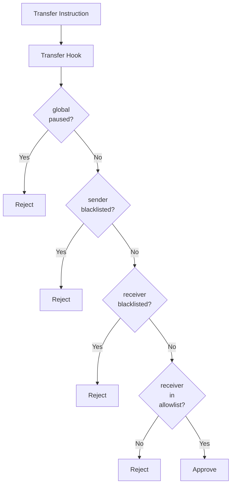

# SSS-3: Privacy Stablecoin Standard

This document defines the SSS-3 specification - the privacy tier of the Solana Stablecoin Standard. SSS-3 extends SSS-2 with privacy features including allowlist gating and confidential transfers.

---

## Table of Contents

- [Overview](#overview)
- [Features](#features)
- [Account Structure](#account-structure)
- [Instructions](#instructions)
- [Transfer Validation](#transfer-validation)
- [PDA Reference](#pda-reference)
- [Security Model](#security-model)
- [Downgrading](#downgrading)

---

## Overview

SSS-3 adds privacy capabilities on top of SSS-2:

- **Allowlist**: Only whitelisted addresses can receive tokens
- **Confidential Transfers**: Optional encrypted transfer amounts (via Token-2022)

**Status:** Privacy module attached (requires SSS-2 first)

---

## Features

### SSS-1 Features (Inherited)

| Feature     | Description                 |
| ----------- | --------------------------- |
| **Mint**    | Create new tokens           |
| **Burn**    | Destroy tokens              |
| **Freeze**  | Freeze a specific account   |
| **Thaw**    | Unfreeze an account         |
| **Pause**   | Stop all transfers globally |
| **Unpause** | Resume transfers            |

### SSS-2 Features (Inherited)

| Feature           | Description                               |
| ----------------- | ----------------------------------------- |
| **Blacklist**     | Block addresses from transfers            |
| **Seize**         | Transfer tokens from blacklisted accounts |
| **Transfer Hook** | Automatic compliance on every transfer    |

### SSS-3 Additional Features

| Feature                    | Description                            |
| -------------------------- | -------------------------------------- |
| **Allowlist**              | Only whitelisted addresses can receive |
| **Confidential Transfers** | Optional encrypted amounts             |

---

## Account Structure

### PrivacyModule

```rust
pub struct PrivacyModule {
    pub config: Pubkey,                       // 32 - back-ref to config
    pub authority: Pubkey,                    // 32 - module authority
    pub allowlist_authority: Pubkey,          // 32 - allowlist authority
    pub confidential_transfers_enabled: bool,  // 1 - confidential transfers flag
    pub bump: u8,                             // 1
}
```

### AllowlistEntry

```rust
pub struct AllowlistEntry {
    pub wallet: Pubkey,      // 32 - whitelisted wallet
    pub approved_by: Pubkey, // 32 - who added this entry
    pub approved_at: i64,   // 8 - Unix timestamp
    pub bump: u8,           // 1
}
```

---

## Instructions

### attach_privacy_module

Attach the privacy module to enable SSS-3 features.

**Discriminator:** `c713ab51093e7300`

**Arguments:**

```rust
struct AttachPrivacyArgs {
    pub allowlist_authority: Pubkey,  // Allowlist authority
    pub confidential: bool,          // Enable confidential transfers
}
```

**Accounts:**
| Role | Write | Sign | Description |
|------|-------|------|-------------|
| privacy_module | ✅ | ✅ | PrivacyModule PDA (init) |
| config | | ✅ | StablecoinConfig |
| authority | | ✅ | Master authority |
| system_program | | | System program |

**Prerequisite:** Compliance module must be attached (SSS-2 required first)

---

### detach_privacy_module

Remove the privacy module (downgrade to SSS-2).

**Discriminator:** `9568348247ace23f`

**Accounts:**
| Role | Write | Sign | Description |
|------|-------|------|-------------|
| privacy_module | ✅ | | PrivacyModule PDA (close) |
| config | | ✅ | StablecoinConfig |
| authority | | ✅ | Master authority |

**Warning:** This closes all allowlist entries.

---

### allowlist_add

Add an address to the allowlist.

**Discriminator:** `2a05819f37a567cb`

**Accounts:**
| Role | Write | Sign | Description |
|------|-------|------|-------------|
| allowlist_entry | ✅ | ✅ | AllowlistEntry PDA (init) |
| privacy_module | | | PrivacyModule |
| config | | | StablecoinConfig |
| allowlist_authority | | ✅ | Allowlist authority |
| wallet | | | Account to whitelist |
| system_program | | | System program |

**Logic:**

1. Derive allowlist PDA: `[b"allowlist", privacy_module, wallet]`
2. Store wallet, approver, timestamp
3. Emit `AddedToAllowlist` event

---

### allowlist_remove

Remove an address from the allowlist.

**Discriminator:** `1e1453d2bc9bd3a3`

**Accounts:**
| Role | Write | Sign | Description |
|------|-------|------|-------------|
| allowlist_entry | ✅ | | AllowlistEntry PDA (close) |
| privacy_module | | | PrivacyModule |
| config | | | StablecoinConfig |
| allowlist_authority | | ✅ | Allowlist authority |
| wallet | | | Account to remove |
| authority | | ✅ | Authority |

---

## Transfer Validation

In SSS-3, every transfer is validated against both the blacklist (from SSS-2) and the allowlist.

### Validation Flow



### Transfer Hook Checks

1. **Global Pause**: If config.paused == true, reject
2. **Sender Blacklist**: If sender is blacklisted, reject
3. **Receiver Blacklist**: If receiver is blacklisted, reject
4. **Allowlist**: If receiver not in allowlist (SSS-3), reject

### Confidential Transfers

When `confidential_transfers_enabled` is true:

- Senders can encrypt transfer amounts
- Receivers decrypt incoming amounts
- Proof verification via Token-2022 extension

---

## PDA Reference

| Account        | Seeds                                                | Size      |
| -------------- | ---------------------------------------------------- | --------- |
| PrivacyModule  | `[b"privacy", config.key()]`                         | ~98 bytes |
| AllowlistEntry | `[b"allowlist", privacy_module.key(), wallet.key()]` | ~74 bytes |

---

## Security Model

### Authority Hierarchy

```
master_authority
    ├── minter (can mint)
    ├── freezer (can freeze/thaw)
    ├── pauser (can pause/unpause)
    ├── blacklister (can blacklist/seize)
    └── allowlist_authority (can allowlist)
```

### Transfer Restrictions

In SSS-3:

- **Senders**: Can be anyone (not blacklisted)
- **Receivers**: Must be on allowlist
- This enables "whitelisted recipients" use cases

### Threat Mitigation

| Threat             | Mitigation                    |
| ------------------ | ----------------------------- |
| Unwanted transfers | Allowlist gates recipients    |
| Privacy leaks      | Confidential transfers option |
| Compliance bypass  | Blacklist still enforced      |

---

## Downgrading

### Downgrade to SSS-2

```bash
sss-cli detach-privacy
```

This removes:

- Allowlist entries
- Privacy module
- Confidential transfers capability

The compliance module remains (SSS-2 features intact).

### Downgrade to SSS-1

```bash
sss-cli detach-compliance
```

This removes both privacy and compliance modules entirely.
